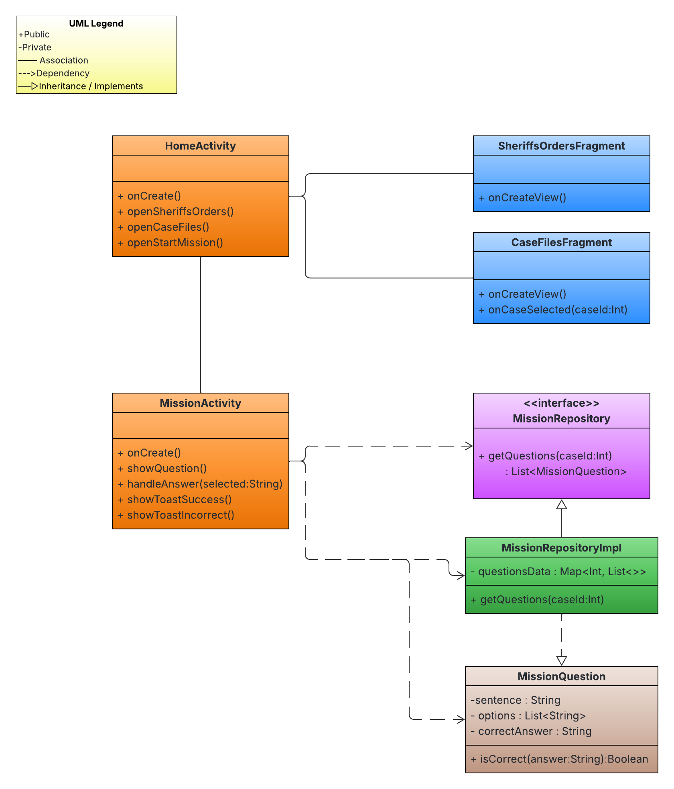
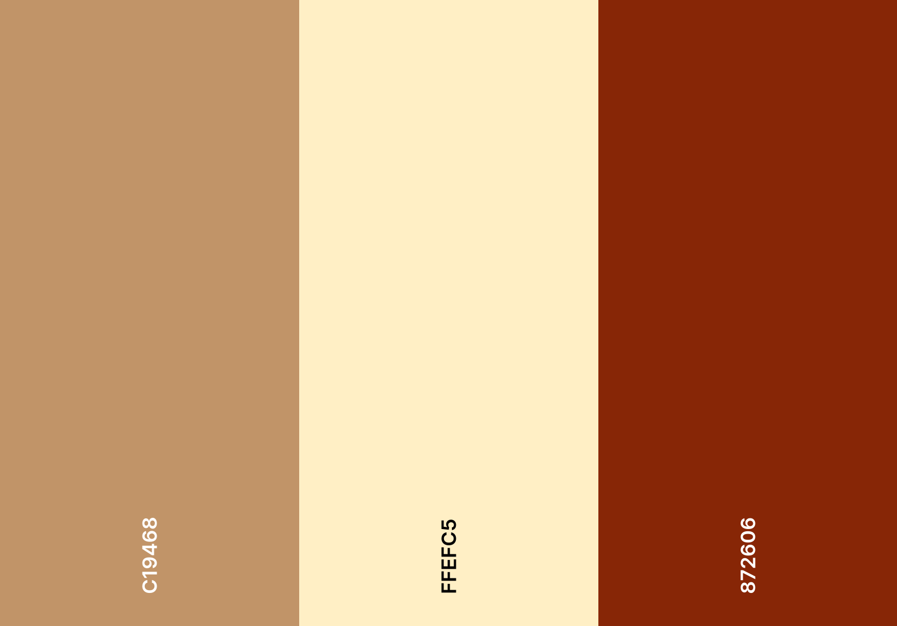
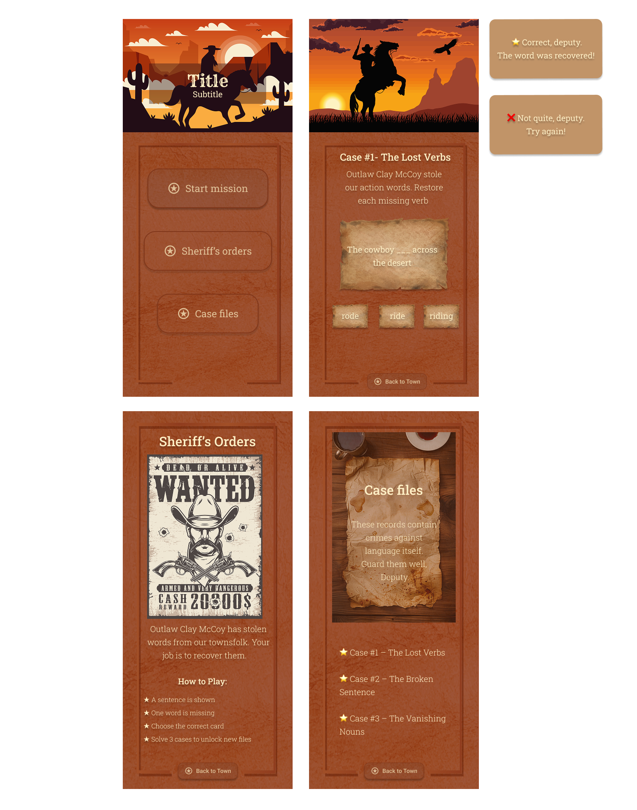

# Sheriff’s Word Hunt

Sheriff’s Word Hunt is a playful and immersive language game designed for children ages 10–13.
Players step into the role of junior deputies in a Wild West town where a mysterious bandit has been stealing words from sentences. Their mission is to solve language puzzles, catch the culprit, and restore order — one word at a time.

## Table of Contents
- [UX](#ux)
    - [App Purpose](#app-purpose)
    - [App Goal](#app-goal)
    - [Developer Goals](#developer-goals)
    - [User Goals](#user-goals)
    - [Audience](#audience)
    - [Communication](#communication)
    - [Interaction & Experience Principles](#interaction--experience-principles)
- [Agile Planning](#agile-planning)
    - [Epics & User Stories](#epics--user-stories)
    - [Implemented User Stories](#implemented-user-stories)
    - [Not implemented User Stories](#not-implemented-user-stories)
    - [MoSCoW Prioritization](#moscow-prioritization)
    - [Kanban Board](#kanban-board)
    - [UML Diagram](#uml-diagram)
- [Design](#design)
    - [Wireframe](#wireframe)
    - [Colour Scheme](#colour-scheme)
    - [Fonts](#fonts)
- [Features](#features)
    - [Existing Features](#existing-features)
    - [Future Features](#future-features)
- [Testing](#testing)
    - [Manual Testing](#manual-testing)
    - [Bugs](#bugs)
    - [Unfixed Bugs](#unfixed-bugs)
- [Technologies](#technologies)
    - [Main Languages Used](#main-languages-used)
    - [Setup & Installation](#setup--installation)
- [Credits](#credits)
    - [Content](#content)
    - [Media](#media)

## UX
### App Purpose
Sheriff’s Word Hunt helps children practice language and reading comprehension through short, game-like word puzzles wrapped in a playful Wild West theme.

### App Goal
The goal is to create an engaging and intuitive learning experience where children can strengthen overall language skills — including reading comprehension, context understanding, and vocabulary — through short, playful challenges.

### Developer Goals
- Maintain clean, testable architecture
- Use a Repository Pattern for puzzle logic
- Keep Activities simple and focused
- Use ViewBinding for safer UI handling

### User Goals
- Quickly understand how to play
- Solve puzzles with minimal frustration
- Receive instant feedback
- Progress smoothly between challenges
- Stay motivated through a simple, playful theme

### Audience
Children ages 10–13.  
Designed to be usable by all children, but visually and structurally supportive for users who benefit from reduced cognitive load (e.g., ADHD, autism, dyslexia).

### Communication
The app communicates through clear buttons, minimal choices, simple text, and short feedback toasts. The theme supports motivation while keeping the interface calm and predictable.

### Interaction & Experience Principles
- Clear and predictable navigation
- Limited choices per screen
- Short non-blocking feedback (toasts)
- Smooth transitions between puzzles
- Calming, low-contrast visuals
- Reduced cognitive load through simple layouts

## Agile Planning
The development of Sheriff’s Word Hunt was planned using Agile methodology. All functionality was divided into Epics and refined into User Stories, each assigned a MoSCoW priority.

### Epics & User Stories

#### EPIC 1: Core Gameplay
Focuses on the fundamental mission flow, puzzle interaction, and feedback loops.

[View Epic 1](https://github.com/Linnea87/sheriffs-word-hunt/issues/1)

*User Stories under this Epic:*
- [US 1: Start a mission](https://github.com/Linnea87/sheriffs-word-hunt/issues/2) 
- [US 2: See the word puzzle clearly](https://github.com/Linnea87/sheriffs-word-hunt/issues/3) 
- [US 3: Choose between answer cards](https://github.com/Linnea87/sheriffs-word-hunt/issues/4)
- [US 4: Immediate feedback](https://github.com/Linnea87/sheriffs-word-hunt/issues/5)
- [US 5: Maintainable game logic (Repository Pattern)](https://github.com/Linnea87/sheriffs-word-hunt/issues/6)

#### EPIC 2: Navigation & Structure
Ensures intuitive movement between screens and simple UI flow.

[View Epic 2](https://github.com/Linnea87/sheriffs-word-hunt/issues/7)

*User Stories under this Epic:*
- [US 6: Navigate from home screen](https://github.com/Linnea87/sheriffs-word-hunt/issues/8)
- [US 7: Open Sheriff’s Orders](https://github.com/Linnea87/sheriffs-word-hunt/issues/9)
- [US 8: Open Case Files](https://github.com/Linnea87/sheriffs-word-hunt/issues/10)
- [US 9: Smooth back navigation](https://github.com/Linnea87/sheriffs-word-hunt/issues/11)
- [US 10: Reusable fragment structure](https://github.com/Linnea87/sheriffs-word-hunt/issues/12)

#### EPIC 3: Visual Design & Accessibility
Covers colour palette, typography, and minimizing cognitive load.

[View Epic 3](https://github.com/Linnea87/sheriffs-word-hunt/issues/13)

*User Stories under this Epic:*
- [US 11: Readable typography and contrast](https://github.com/Linnea87/sheriffs-word-hunt/issues/14)
- [US 12: Low visual overload](https://github.com/Linnea87/sheriffs-word-hunt/issues/15)
- [US 13: Consistent color palette and theme](https://github.com/Linnea87/sheriffs-word-hunt/issues/16)
- [US 14: Friendly, non-blocking feedback wording](https://github.com/Linnea87/sheriffs-word-hunt/issues/17)

#### EPIC 4: Progress & Saving
Supports session saving and restoring gameplay. 

[View Epic 4](https://github.com/Linnea87/sheriffs-word-hunt/issues/18)

*User Stories under this Epic:*
- [US 15: Save mission progress](https://github.com/Linnea87/sheriffs-word-hunt/issues/19)
- [US 16: Load mission progress](https://github.com/Linnea87/sheriffs-word-hunt/issues/20)
- [US 17: Unlock Case Files](https://github.com/Linnea87/sheriffs-word-hunt/issues/21)
- [US 18: Store settings/preferences](https://github.com/Linnea87/sheriffs-word-hunt/issues/22)

#### Implemented User Stories
#### Not implemented User Stories
### MoSCoW Prioritization

| Priority | Description |
|---------|-------------|
| **Must Have** | Core gameplay mechanics, navigation, simple UI flow, essential feedback. |
| **Should Have** | Accessibility improvements, aesthetic enhancements, improved readability. |
| **Could Have** | Additional polish, animations, more puzzle variations. |

### Kanban Board
The project is organized using a GitHub Project Kanban board to track progress from **To Do → In Progress → Done**.
[View Kanban](https://github.com/users/Linnea87/projects/14)

### UML Diagram
The UML diagram was created in [**Lucidchart**](https://www.lucidchart.com/) and outlines the flow between Activities, Fragments, and the Repository layer. It serves as a blueprint for the app’s architecture and game progression.

## Design
The design of Sheriff’s Word Hunt focuses on creating a calm, readable, and thematic visual experience. 
The Western-inspired colour palette, textured cards, and simple screen layouts support a low-cognitive-load 
environment while keeping the game playful and engaging.

### Colour Scheme
Sheriff’s Word Hunt uses a limited colour palette supported by textured paper elements to reinforce the Wild West atmosphere and maintain a calm, readable interface for children.

The colors were sampled from the in-app designs created in [Figma](https://www.figma.com/), and the final palette layout was assembled using [Coolors](https://coolors.co/).

- **Primary background / card color:** `#872606`  
A deep Western red inspired by worn saloon signs and wanted posters, forming the main mood of the UI.

- **Toast feedback background:** `#C19468`  
A warm paper tone used for short success/failure feedback messages, providing softer contrast and reducing visual strain.

- **Text color:** `#FFEFC5`  
A light sand color used instead of pure white to reduce glare and improve readability.

This low-contrast, texture-driven UI supports a **more consistent and less visually overwhelming experience**, which may also benefit players who prefer predictable and calmer visual environments, including some neurodivergent users.

*Color Palette* 

### Wireframe
The wireframes were created in [Figma](https://www.figma.com/) and illustrate the core layout and screen structure of the app.

### Fonts
Sheriff’s Word Hunt uses two fonts chosen to balance Wild West style with child-friendly readability:

- **Rye** - Used only for the main game title on the hero screen. This font gives a classic Wild West poster look and helps set the theme immediately.

- **Roboto Slab** - Used for all other text in the app, including:
  - Subtitle on the hero screen
  - Buttons
  - Body text
  - Headings (except hero title)
  - Toast messages
  - Cards, labels, and UI elements

Roboto Slab is used in multiple weights (Regular and Light) to keep the interface calm, readable, and visually consistent.
Its clean geometric shapes and soft serifs support accessibility, especially for children who may struggle with high-contrast or overly decorative text (e.g., dyslexia, ADHD).

## Features
### Existing Features
### Future Features
## Testing
### Manual Testing
### Bugs
### Unfixed Bugs
## Technologies
### Main Languages Used
### Setup & Installation
## Credits
### Content
### Media
- All decorative images and graphical assets are sourced from [Freepik](https://www.freepik.com/).

