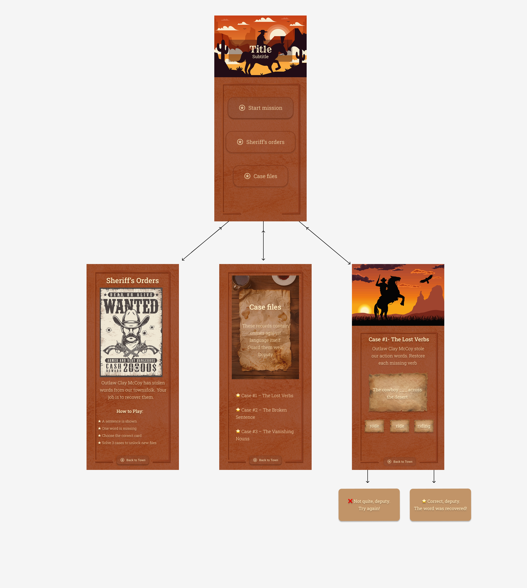

# Sheriff’s Word Hunt

## 🎨 UX Design (Draft)

Sheriff’s Word Hunt is a **card-based language game** for children ages **10–13**. 
Players take on the role of junior deputies solving word mysteries in a **Wild West** setting. The game presents each challenge through **card interactions**, allowing it to meet the requirements of a card-game format while supporting a more playful learning experience.

The design focuses on:

- **Clear and predictable navigation**
- **Limited choices per screen** to avoid overwhelm
- **Short feedback messages** (toasts) instead of blocking dialogs
- Motivating, thematic visuals to make learning feel like a **game, not a school task**

These choices aim to keep the experience engaging and accessible, including for users who may benefit from **reduced cognitive load** (e.g., ADHD, autism, dyslexia).

### Visual Style

Sheriff’s Word Hunt uses a visual approach based on a **limited color palette** supported by **paper and poster textures** instead of a traditional multi-color UI. This helps reinforce the Wild West atmosphere, making the interface feel like real case documents from the Sheriff's office rather than a digital menu.

**Primary background / card color:** `#872606`  
A deep Western red inspired by worn saloon signs and wanted posters, forming the main mood of the UI.

**Toast feedback background:** `#C19468`  
A warm paper tone used for short success/failure feedback messages, providing softer contrast and reducing visual strain.

**Text color:** `#FFEFC5`  
A light sand color used instead of pure white to reduce glare and improve readability.

This low-contrast, texture-driven UI supports a **more consistent and less visually overwhelming experience**, which may also benefit players who prefer predictable and calmer visual environments, including some neurodivergent users.

*Color Palette*

### Wireframe Flow

This sketch illustrates the core navigation structure of the app  
*(early concept — may evolve during implementation)*:

