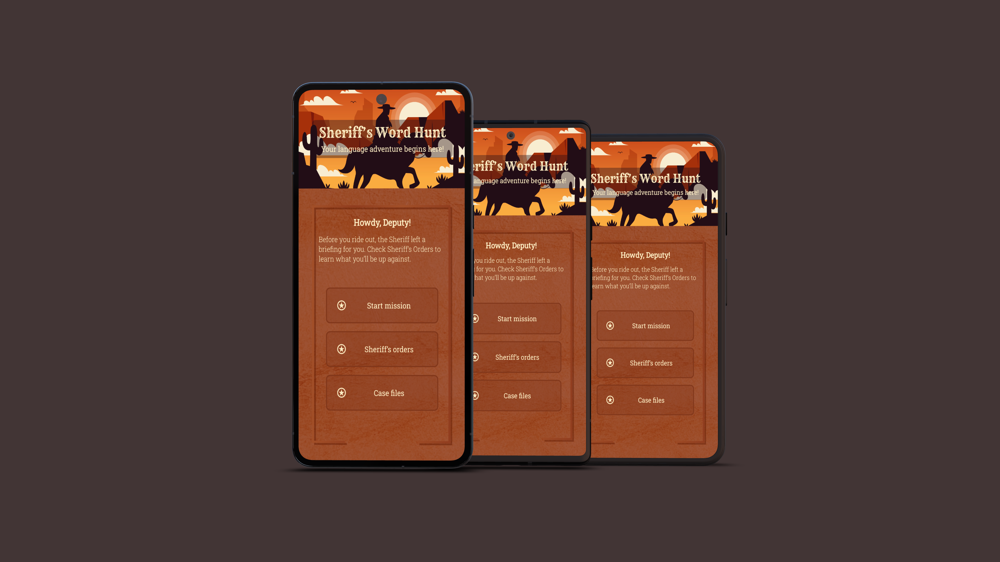

# Sheriff’s Word Hunt



Sheriff’s Word Hunt is a playful and immersive language game designed for children ages 10–13.
Players step into the role of junior deputies in a Wild West town where a mysterious bandit has been stealing words from sentences. Their mission is to solve language puzzles, catch the culprit, and restore order — one word at a time.

## Table of Contents
- [UX](#ux)
    - [App Purpose](#app-purpose)
    - [App Goal](#app-goal)
    - [Developer Goals](#developer-goals)
    - [User Goals](#user-goals)
    - [Audience](#audience)
    - [Communication](#communication)
    - [Interaction & Experience Principles](#interaction--experience-principles) 
- [Agile Planning](#agile-planning)
    - [Epics & User Stories](#epics--user-stories)
    - [Implemented User Stories](#implemented-user-stories)
    - [Not implemented User Stories](#not-implemented-user-stories)
    - [MoSCoW Prioritization](#moscow-prioritization)
    - [Kanban Board](#kanban-board)
    - [UML Diagram](#uml-diagram)
- [Design](#design)
    - [Wireframe](#wireframe)
    - [Colour Scheme](#colour-scheme)
    - [Fonts](#fonts)
- [Features](#features)
    - [Existing Features](#existing-features)
    - [Future Features](#future-features)
- [Testing](#testing)
    - [Manual Testing](#manual-testing)
    - [Bugs](#bugs)
    - [Unfixed Bugs](#unfixed-bugs)
- [Technologies](#technologies)
    - [Main Languages Used](#main-languages-used)
    - [Challenges & Solutions](#challenges--solutions)
    - [Setup & Installation](#setup--installation)
- [Credits](#credits)
    - [Content](#content)
    - [Media](#media)

## UX
### App Purpose
Sheriff’s Word Hunt helps children practice language and reading comprehension through short, game-like word puzzles wrapped in a playful Wild West theme.

### App Goal
The goal is to create an engaging and intuitive learning experience where children can strengthen overall language skills — including reading comprehension, context understanding, and vocabulary — through short, playful challenges.

### Developer Goals
- Maintain clean, testable architecture
- Use a Repository Pattern for puzzle logic
- Keep Activities simple and focused
- Use ViewBinding for safer UI handling

### User Goals
- Quickly understand how to play
- Solve puzzles with minimal frustration
- Receive instant feedback
- Progress smoothly between challenges
- Stay motivated through a simple, playful theme

### Audience
Children ages 10–13.  
Designed to be usable by all children, but visually and structurally supportive for users who benefit from reduced cognitive load (e.g., ADHD, autism, dyslexia).

### Communication
The app communicates through clear buttons, minimal choices, simple text, and short feedback toasts. The theme supports motivation while keeping the interface calm and predictable.

### Interaction & Experience Principles
- Clear and predictable navigation
- Limited choices per screen
- Short non-blocking feedback (toasts)
- Smooth transitions between puzzles
- Calming, low-contrast visuals
- Reduced cognitive load through simple layouts

## Agile Planning
The development of Sheriff’s Word Hunt was planned using Agile methodology. All functionality was divided into Epics and refined into User Stories, each assigned a MoSCoW priority.

### Epics & User Stories

The project was structured using Agile principles, where all functionality was divided
into epics and further refined into user stories. Each story represents a concrete piece
of functionality from the user’s perspective and guided both development and testing
throughout the project. This ensured a clear scope, steady progress, and a predictable
workflow from initial design to final implementation.

#### EPIC 1: Core Gameplay
Focuses on the fundamental mission flow, puzzle interaction, and feedback loops.

[View Epic 1](https://github.com/Linnea87/sheriffs-word-hunt/issues/1)

*User Stories under this Epic:*
- [US 1: Start a mission](https://github.com/Linnea87/sheriffs-word-hunt/issues/2) 
- [US 2: See the word puzzle clearly](https://github.com/Linnea87/sheriffs-word-hunt/issues/3) 
- [US 3: Choose between answer cards](https://github.com/Linnea87/sheriffs-word-hunt/issues/4)
- [US 4: Immediate feedback](https://github.com/Linnea87/sheriffs-word-hunt/issues/5)
- [US 5: Maintainable game logic (Repository Pattern)](https://github.com/Linnea87/sheriffs-word-hunt/issues/6)


#### EPIC 2: Navigation & Structure
Ensures intuitive movement between screens and simple UI flow.

[View Epic 2](https://github.com/Linnea87/sheriffs-word-hunt/issues/7)

*User Stories under this Epic:*
- [US 6: Navigate from home screen](https://github.com/Linnea87/sheriffs-word-hunt/issues/8)
- [US 7: Open Sheriff’s Orders](https://github.com/Linnea87/sheriffs-word-hunt/issues/9)
- [US 8: Open Case Files](https://github.com/Linnea87/sheriffs-word-hunt/issues/10)
- [US 9: Smooth back navigation](https://github.com/Linnea87/sheriffs-word-hunt/issues/11)
- [US 10: Reusable fragment structure](https://github.com/Linnea87/sheriffs-word-hunt/issues/12)

#### EPIC 3: Visual Design & Accessibility
Covers colour palette, typography, and minimizing cognitive load.

[View Epic 3](https://github.com/Linnea87/sheriffs-word-hunt/issues/13)

*User Stories under this Epic:*
- [US 11: Readable typography and contrast](https://github.com/Linnea87/sheriffs-word-hunt/issues/14)
- [US 12: Low visual overload](https://github.com/Linnea87/sheriffs-word-hunt/issues/15)
- [US 13: Consistent color palette and theme](https://github.com/Linnea87/sheriffs-word-hunt/issues/16)
- [US 14: Friendly, non-blocking feedback wording](https://github.com/Linnea87/sheriffs-word-hunt/issues/17)

#### EPIC 4: Progress & Saving
Supports session saving and restoring gameplay. 

[View Epic 4](https://github.com/Linnea87/sheriffs-word-hunt/issues/18)

*User Stories under this Epic:*
- [US 15: Save mission progress](https://github.com/Linnea87/sheriffs-word-hunt/issues/19)
- [US 16: Load mission progress](https://github.com/Linnea87/sheriffs-word-hunt/issues/20)
- [US 17: Unlock Case Files](https://github.com/Linnea87/sheriffs-word-hunt/issues/21)
- [US 18: Store settings/preferences](https://github.com/Linnea87/sheriffs-word-hunt/issues/22)

### Implemented User Stories

Below is the full list of user stories that were implemented during the development of Sheriff’s Word Hunt.  
These stories cover the core gameplay loop, navigation structure, UI design principles, accessibility improvements, and progress-saving features.  
Each story contributed directly to shaping a complete, functional, and user-friendly product aligned with the project’s goals.

- [US 1: Start a mission](https://github.com/Linnea87/sheriffs-word-hunt/issues/2)
- [US 2: See the word puzzle clearly](https://github.com/Linnea87/sheriffs-word-hunt/issues/3)
- [US 3: Choose between answer cards](https://github.com/Linnea87/sheriffs-word-hunt/issues/4)
- [US 4: Immediate feedback](https://github.com/Linnea87/sheriffs-word-hunt/issues/5)
- [US 5: Maintainable game logic (Repository Pattern)](https://github.com/Linnea87/sheriffs-word-hunt/issues/6)
- [US 6: Navigate from home screen](https://github.com/Linnea87/sheriffs-word-hunt/issues/8)
- [US 7: Open Sheriff’s Orders](https://github.com/Linnea87/sheriffs-word-hunt/issues/9)
- [US 8: Open Case Files](https://github.com/Linnea87/sheriffs-word-hunt/issues/10)
- [US 9: Smooth back navigation](https://github.com/Linnea87/sheriffs-word-hunt/issues/11)
- [US 10: Reusable fragment structure](https://github.com/Linnea87/sheriffs-word-hunt/issues/12)
- [US 11: Readable typography and contrast](https://github.com/Linnea87/sheriffs-word-hunt/issues/14)
- [US 12: Low visual overload](https://github.com/Linnea87/sheriffs-word-hunt/issues/15)
- [US 13: Consistent color palette and theme](https://github.com/Linnea87/sheriffs-word-hunt/issues/16)
- [US 14: Friendly, non-blocking feedback wording](https://github.com/Linnea87/sheriffs-word-hunt/issues/17)
- [US 15: Save mission progress](https://github.com/Linnea87/sheriffs-word-hunt/issues/19)
- [US 16: Load mission progress](https://github.com/Linnea87/sheriffs-word-hunt/issues/20)
- [US 17: Unlock Case Files](https://github.com/Linnea87/sheriffs-word-hunt/issues/21)

### Not Implemented User Stories (Won’t Have)

The following user story was intentionally not implemented as part of this project.  
It was considered outside the scope for the MVP and would not meaningfully impact the core gameplay experience.  
It may be included in a future version if user customization becomes relevant.

- [US 18: Store settings/preferences](https://github.com/Linnea87/sheriffs-word-hunt/issues/22)

### MoSCoW Prioritization

| Priority       | Description                                                                                                                                                      |
|----------------|------------------------------------------------------------------------------------------------------------------------------------------------------------------|
| **Must Have**  | Core gameplay mechanics, navigation, simple UI flow, essential feedback.                                                                                         |
| **Should Have** | Accessibility improvements, aesthetic enhancements, improved readability.                                                                                        |
| **Could Have** | Additional polish, animations, more puzzle variations.                                                                                                           |
| **Won't have** | Optional settings such as saving user preferences. These were intentionally excluded as they do not affect the core learning or gameplay experience for the MVP. |

### Kanban Board
The project is organized using a GitHub Project Kanban board to track progress from **To Do → In Progress → Done**.

[View Kanban](https://github.com/users/Linnea87/projects/14)

### UML Diagram
The UML diagram was created in [**Lucidchart**](https://www.lucidchart.com/) and outlines the flow between Activities, Fragments, and the Repository layer. It serves as a blueprint for the app’s architecture and game progression.


## Design
The design of Sheriff’s Word Hunt focuses on creating a calm, readable, and thematic visual experience. 
The Western-inspired colour palette, textured cards, and simple screen layouts support a low-cognitive-load 
environment while keeping the game playful and engaging.

### Colour Scheme
Sheriff’s Word Hunt uses a limited colour palette supported by textured paper elements to reinforce the Wild West atmosphere and maintain a calm, readable interface for children.

The colors were sampled from the in-app designs created in [Figma](https://www.figma.com/), and the final palette layout was assembled using [Coolors](https://coolors.co/).

- **Primary background / card color:** `#872606`  
A deep Western red inspired by worn saloon signs and wanted posters, forming the main mood of the UI.

- **Toast feedback background:** `#C19468`  
A warm paper tone used for short success/failure feedback messages, providing softer contrast and reducing visual strain.

- **Text color:** `#FFEFC5`  
A light sand color used instead of pure white to reduce glare and improve readability.

This low-contrast, texture-driven UI supports a **more consistent and less visually overwhelming experience**, which may also benefit players who prefer predictable and calmer visual environments, including some neurodivergent users.

*Color Palette* 


### Wireframe
The wireframes were created in [Figma](https://www.figma.com/) and illustrate the core layout and screen structure of the app.


### Fonts
Sheriff’s Word Hunt uses two fonts chosen to balance Wild West style with child-friendly readability:

- **Rye** - Used only for the main game title on the hero screen. This font gives a classic Wild West poster look and helps set the theme immediately.

- **Roboto Slab** - Used for all other text in the app, including:
  - Subtitle on the hero screen
  - Buttons
  - Body text
  - Headings (except hero title)
  - Toast messages
  - Cards, labels, and UI elements

Roboto Slab is used in multiple weights (Regular and Light) to keep the interface calm, readable, and visually consistent.
Its clean geometric shapes and soft serifs support accessibility, especially for children who may struggle with high-contrast or overly decorative text (e.g., dyslexia, ADHD).

## Features
Sheriff’s Word Hunt includes a range of features designed to create a smooth, engaging, and child-friendly learning experience.
This section provides an overview of all implemented functionality, from the home screen and gameplay flow to accessibility-minded UI elements and progress-saving systems.

### Existing Features
#### Home Screen
- Hero section with themed Wild West design
- Clear navigation to Missions, Case Files, and Sheriff’s Orders
- Child-friendly layout with large touch targets and simple choices

#### Mission Gameplay
- Three cases (“bandits”) with unique puzzle sets
- Multiple-choice word puzzles with three answer options
- Immediate feedback via custom toasts
- Case progression saved locally (SharedPreferences)
- “Bandit Captured” dialog when finishing a mission
- Progress bar showing current mission progress

#### Case Files
- Overview of all cases and their completion status
- Locked/unlocked system based on player progression
- Navigation directly into chosen mission

#### Sheriff’s Orders
- Simple, readable explanation of game rules and the story setting
- Consistent visual style with hero header

#### Custom UI Components
- Custom dialog layouts styled with Western paper texture
- Custom Toast designs for correct/incorrect feedback
- Reusable hero layout used across multiple screens

#### Progress Saving
- All case unlocks saved between sessions
- Mission progress saved automatically
- Repository-driven question generation for maintainable game logic
- 
### Future Features
- **More Cases:** Add additional bandits with new question sets.
- **Animations:** Smooth transitions when answering questions or unlocking cases.
- **Sound Effects:** Soft Western-style sounds for correct answers and mission events.
- **Statistics Screen:** Show total progress, accuracy, and completed missions.
- **Difficulty Levels:** Introduce beginner/intermediate/advanced modes with varied question types.
- **Language Settings:** Allow choosing English/Swedish interface and puzzles.

## Testing
The application was thoroughly tested throughout the development process to ensure reliability, consistent gameplay, and correct behavior across different device sizes.
This section outlines the manual testing scenarios, identified bugs, and final results of the quality assurance process.


### Manual Testing
The app was tested manually throughout the development process using Android Studio emulators (Pixel 4 and a Medium Phone configuration).

#### Tested Scenarios
- Launching the app on different emulator screen sizes and densities
- Navigating between all screens: Home → Mission → Case Files → Sheriff’s Orders
- Completing all missions from start to finish
- Testing both correct and incorrect answers for each question
- Verifying that progress is saved when closing and reopening the emulator
- Ensuring Case 2 unlocks after completing Case 1, and Case 3 unlocks after Case 2
- Checking that custom dialogs appear and behave correctly (Bandit Captured, Case Unlocked)
- Confirming that back navigation works as expected from all screens
- Reviewing layout spacing, text size, and button alignment on multiple emulator presets

All essential gameplay features worked consistently during emulator testing.

### Bugs
#### 1. “Case Unlocked” dialog triggered again when returning to a previously completed case.
***Status***  - ✔ Fixed

**Description**  
After answering three questions correctly and unlocking the next case, the player could return to a previous case, answer another question, and see the “Case unlocked” dialog again — even though the next case was already unlocked.

**Cause**  
When loading saved progress, the `correctAnswers` counter was restored to the number of previously correct answers for that case.  
If the player had, for example, 2 correct answers saved and then answered 1 more correctly, `correctAnswers` reached 3 again.  
The unlock logic only checked the threshold, not whether the unlock event had already effectively been handled in a previous session.

**Fix**  
The unlock condition was updated to trigger only when:

```
if (correctAnswers == 3) {
    val nextCaseId = currentCaseId + 1
    if (repository.getCaseById(nextCaseId) != null) {
        gameProgressRepository.unlockCase(nextCaseId)
        _caseUnlocked.value = true
    }
}
```
This ensures the unlock event happens exactly when the player reaches three correct answers in a case, and does not repeatedly retrigger on later visits.

### Unfixed Bugs
There are currently no known unfixed bugs.

## Technologies
The development of Sheriff’s Word Hunt is built on a modern Android stack focused on clarity, maintainability, and a smooth user experience.  
The app combines standard Android components with structured architectural patterns to ensure predictable behavior and easy scalability.  
Below is an overview of the main technologies, tools, and patterns used throughout the project.

### Main Languages Used
- **Kotlin** – The primary programming language used for the application.  
  Kotlin was chosen for its modern syntax, null-safety features, and seamless integration with Android Jetpack components.

- **XML** – Used for all UI layout files, custom drawables, and theme definitions.  
  XML provided full control over the visual structure, spacing, layering, and reusable UI components used throughout the app.

### Challenges & Solutions
#### 1. Recreating the Figma Hero Section in Android (Layering, Colors, Transparency)

**Challenge**  
The hero section designed in Figma contained multiple layered elements (paper texture, background overlay, text area) with subtle transparency effects.  
When implementing the design in Android Studio, the visual result did not match the Figma version — the overlay appeared too dark or too light, text contrast was incorrect, and the overall composition looked flat.

**Cause**  
Figma exports do not translate directly into Android’s rendering model.  
Android requires separate drawables, and transparency must be defined using ARGB hex values (`#AARRGGBB`).  
This meant the original overlay and background layers needed to be recreated manually for accurate results.

**Solution**
- Created a dedicated drawable for the paper background (`bg_paper.xml`)
- Created a separate overlay drawable with the correct alpha value (`bg_hero_text.xml`, using `#63220D16`)
- Moved the hero section into an include layout for reuse (`hero_layout.xml`)
- Centralized all colors and measurements in `colors.xml` and `dimens.xml` for consistency

**Result**  
The final hero layout matches the original Figma design much more closely.  
Layering, transparency, and depth now render correctly across all devices.

---

#### 2. Custom Buttons Were Overridden by Material Theme (Blue Tint & Ripple Issue)

**Challenge**  
When creating custom buttons for the Home screen, Android applied an unwanted **blue tint**, **blue outline**, and **Material ripple effect** — even though custom backgrounds and colors were defined.

**Cause**  
Android’s default `Button` class inherits behavior from the MaterialComponents theme, which automatically applies:
- `backgroundTint`
- Ripple animation
- Elevation changes via `stateListAnimator`

These overrides happen *even when* you manually set `android:background`, causing inconsistencies with the intended design.

**Solution**
- Switched to `androidx.appcompat.widget.AppCompatButton` to avoid unwanted Material overrides
- Disabled automatic tinting by removing `backgroundTint`
- Disabled elevation animations using:
    ```
  <item name="android:stateListAnimator">@null</item>
     ```
### Setup & Installation
1. **Clone the repository**
   ```
   git clone https://github.com/Linnea87/sheriffs-word-hunt.git
     ```
2. **Open the project in Android Studio**

    - Minimum Android Studio version: Arctic Fox or higher
    - Allow Gradle to sync automatically

3. **Run the app**
      - Select an emulator (tested using Pixel 4 + Medium Phone config)
      - or connect a physical Android device
      - Click Run → Run ‘app’

4. **Minimum Requirements**
      - Min SDK: API 21 (Android 5.0)
      - Target SDK: API 34
      - Requires no external services or API keys

The app will launch directly on the selected device and is ready to test without further configuration.
   
## Credits
This section lists all sources used in the project, including written content and visual assets.
Only external media that is not created by the developer is referenced here to ensure transparency and proper attribution.

### Content
All text content, puzzles, and story elements in Sheriff’s Word Hunt were written specifically for this project.
No external written material was used.

### Media
- All decorative images and graphical assets are sourced from [Freepik](https://www.freepik.com/).
- Device mockup created using [DeviceFrames](https://deviceframes.com/).

---

**Created by Linnéa Ternevik, 2025**

